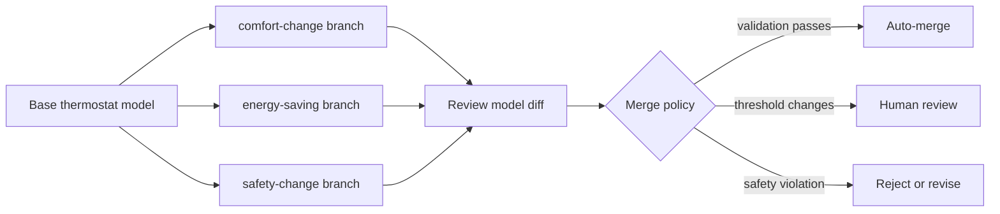

<p align="center">
  <a href="https://www.openmbee.org/">
    
  </a>
</p>

<h1 align="center">Flexo MMS Deployment</h1>

<p align="center">
  One-click and one-command entry points for running Flexo MMS, loading an example model, and learning graph-native model lifecycle management.
</p>

<p align="center">
  <a href="https://flexo-mms-deployment-guide.readthedocs.io/en/latest/index.html">
    
  </a>
  <a href="https://github.com/Open-MBEE/flexo-mms-deployment/actions">
    
  </a>
  <a href="https://github.com/Open-MBEE/flexo-mms-deployment/blob/develop/LICENSE">
    
  </a>
  <a href="https://github.com/Open-MBEE/flexo-mms-deployment/issues">
    
  </a>
  <a href="https://www.openmbee.org/participate.html">
    
  </a>
</p>

<p align="center">
  <a href="https://github.com/codespaces/new?hide_repo_select=true&ref=develop&repo=Open-MBEE%2Fflexo-mms-deployment">
    
  </a>
  <a href="https://gitpod.io/#https://github.com/Open-MBEE/flexo-mms-deployment">
    
  </a>
  <a href="#quickstart">
    
  </a>
</p>

---

## Why This Repository Exists

Flexo MMS is OpenMBEE's graph-native model management stack. This repository provides deployment examples for running the Flexo service set with Docker Compose or Kubernetes.

The goal of this draft README is to make the repository friendlier for first-time contributors:

- start the local service set quickly
- verify the services are healthy
- load a small SysML v2 model
- create branches for competing engineering changes
- inspect model lifecycle scenarios such as diff, review, conflict, and merge policy

## Quickstart

The current Docker Compose stack can be started from the `docker-compose/` directory:

```sh
cd docker-compose
docker compose up -d
curl -u user01:password1 http://localhost:8082/login
```

The stack starts:

- OpenLDAP
- Apache Fuseki
- MinIO
- Flexo MMS Auth Service
- Flexo MMS Store Service
- Flexo MMS Layer 1 Service

### Proposed contributor helper

> [!NOTE]
> This is a proposed contributor experience. The `demo` helper, SysML v2 service wiring, and thermostat seed model are planned additions, not current repository behavior.

```sh
git clone https://github.com/Open-MBEE/flexo-mms-deployment.git
cd flexo-mms-deployment
./demo up
./demo seed thermostat
./demo check
```

Expected result:

```text
Flexo MMS Layer 1: OK
Flexo MMS SysML v2 API: OK
Graph store: OK
Thermostat lifecycle model: loaded
Branches: base, comfort-change, energy-saving, safety-change
Try: http://localhost:8083/projects
```

## One-Click Developer Entry

| Option | Best For | Status |
| --- | --- | --- |
| GitHub Codespaces | Fastest contributor onboarding | Proposed |
| Gitpod | Browser-based evaluation | Proposed |
| Docker Compose | Canonical local development | Existing foundation |
| Kubernetes | Deployment and operations testing | Existing foundation |
| DigitalOcean one-click | Future hosted demo deployment | Candidate |

## First Example: Smart Thermostat Lifecycle

The proposed first onboarding model is a smart thermostat because the system is intentionally easy to understand. The point is not to teach HVAC; the point is to teach Flexo model lifecycle management.

The example model includes:

- `SmartThermostat`
- `TemperatureSensor`
- `Controller`
- `Heater`
- `CoolingUnit`
- `Room`
- `Display`

The model starts with a base comfort-band requirement, then creates competing branches:

| Branch | Change | Lifecycle Concept |
| --- | --- | --- |
| `base` | Maintain temperature between `20 C` and `24 C` | Initial model state |
| `comfort-change` | Narrow comfort band to `21 C` through `23 C` | Requirement change |
| `energy-saving` | Widen comfort band and delay actuation | Competing requirement change |
| `safety-change` | Strengthen sensor fault handling | Safety/governance change |

## Model Lifecycle Walkthrough



Example policies:

- Auto-merge documentation-only changes.
- Auto-merge graph-disjoint changes when validation passes.
- Require review when a requirement threshold changes.
- Require safety review when fault behavior changes.
- Reject merged states that allow simultaneous heating and cooling.

## Repository Roadmap

The proposed developer-entry work can be delivered in small PRs:

1. Add `examples/thermostat-lifecycle/README.md`.
2. Add SysML v2 seed files for the base model and branch variants.
3. Add Bruno or Postman collections for common API calls.
4. Add `demo up`, `demo down`, `demo seed`, `demo check`, and `demo logs`.
5. Add health checks for Layer 1, SysML v2, and the graph store.
6. Add a `.devcontainer/` configuration for Codespaces.
7. Add screenshots or terminal output showing a successful run.

## Existing Documentation

- [Flexo MMS Deployment Guide](https://flexo-mms-deployment-guide.readthedocs.io/en/latest/index.html)
- [OpenMBEE](https://www.openmbee.org/)
- [OpenMBEE participation resources](https://www.openmbee.org/participate.html)
- [Flexo MMS Layer 1 Service](https://github.com/Open-MBEE/flexo-mms-layer1-service)
- [Flexo MMS SysML v2](https://github.com/Open-MBEE/flexo-mms-sysmlv2)

## Contributing

Suggested first issues:

- Run the Docker Compose stack and document missing steps.
- Add a health-check script for local services.
- Add the thermostat seed model.
- Add API examples for creating projects, branches, and commits.
- Add a conflict-resolution walkthrough for comfort versus energy-saving changes.

Before starting larger work, please confirm with maintainers where the example should live and which branch should receive developer-experience contributions.
